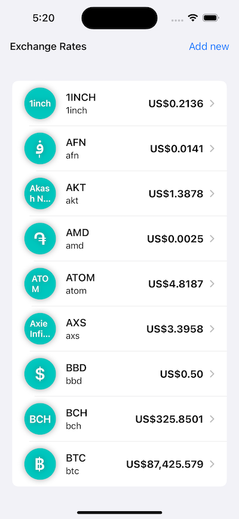
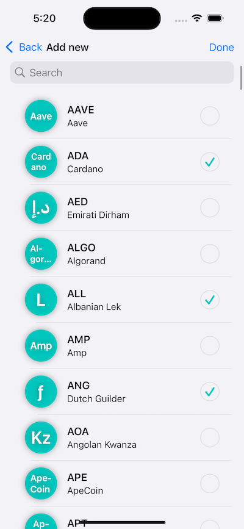

# Rates
Real-Time Exchange Rate Tracker app test project

# Project Structure
The project follows a loosely adapted MVVM architecture, where:

- *Models* represent entities that describe data outside the app's domain (e.g., API response, storage model). See DataManagers/LocalStorage/Models/RateDataModel.swift.
- *ViewModels* act as repositories, encapsulating the main app logic. They interact with local and remote storages (see DataManagers) to retrieve data and transform it into the app's domain layer (whether actual data or errors). The `state` property is exposed for views to observe and present the data.
- *Views* define any piece of visual content on the screen (using SwiftUI's View).
- *DataManagers* are abstractions for API calls and persistence layers.

Additionally:

- SwiftUI is used for the presentation layer, as it is ideal for rapid prototyping (it turned out to be the opposite in my case).
- Combine is used for view-model bindings, as it integrates seamlessly with SwiftUI.
- SwiftData is used for persistent data storage, as it provides an easy native solution.
- URLSession is used for making network requests. The data source is https://github.com/fawazahmed0/exchange-api.

# Features

- The initial screen displays a list of currencies pre-selected by the user and an option to open the currency picker screen to track more currencies (see Screens/Rates).
- The currency picker screen shows a searchable list of all available currencies, excluding those already presented on the initial screen (see Screens/Currencies).

Rate|Picker
---|---
|

# Unit Tests

The unit tests cover core features:

- Validate that the selected currencies' rates are updated and stored.
- Validate that the currency picker screen doesn't display already added elements.
- Validate that item selection works as expected.

Each test uses fake storages that record their public API calls (see Invocations) and return pre-configured results.

# Things to Improve

- Make the states of the repositories equatable to reduce unnecessary reloads of target views.
- Although the main entities are decoupled through abstract interfaces, they are still instantiated and configured in place with required dependencies. It would be great to implement a pre-configured DI container.
- Add localization support.
- Add user settings for the refresh interval and base currency.
- Add unit tests for additional cases (such as failures).
